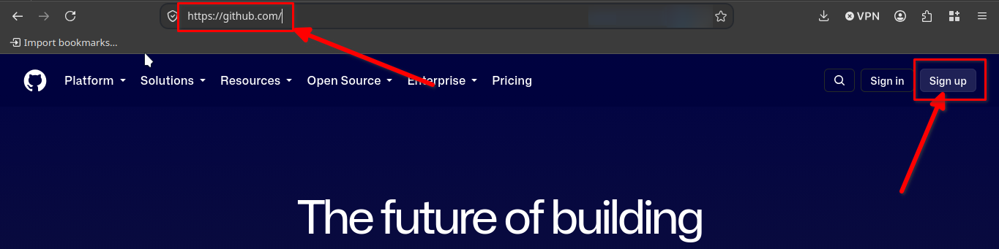
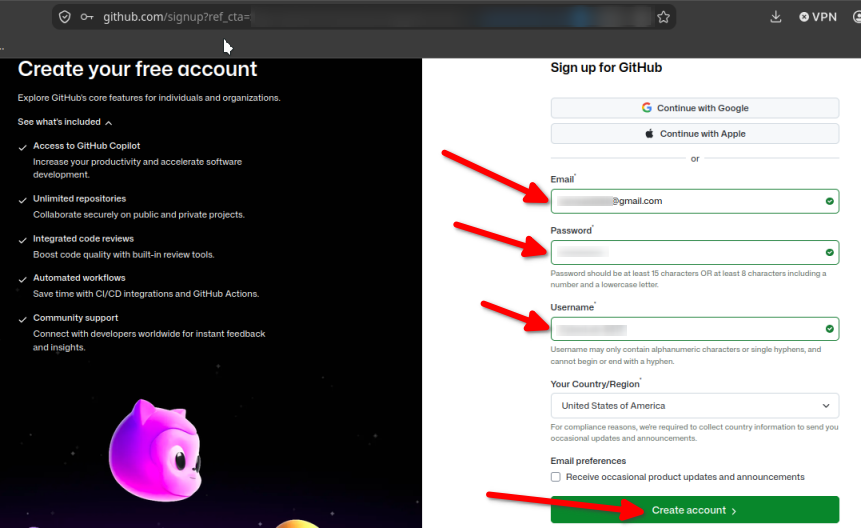
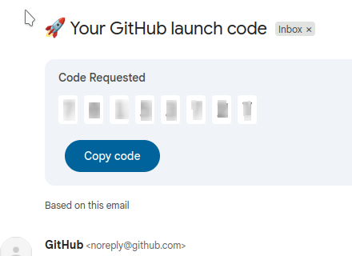
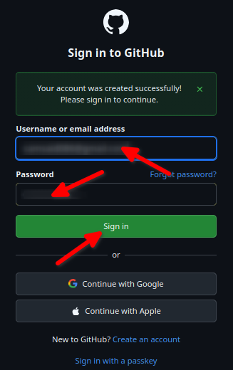
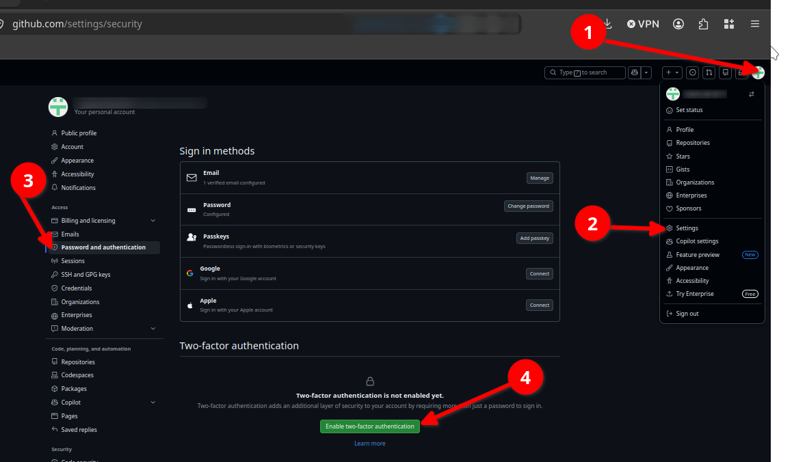
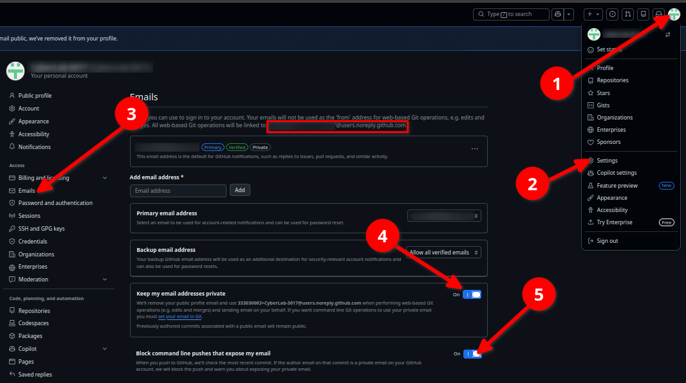
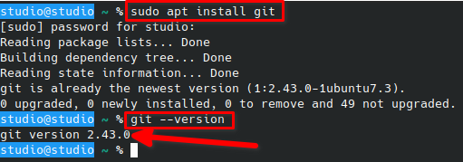
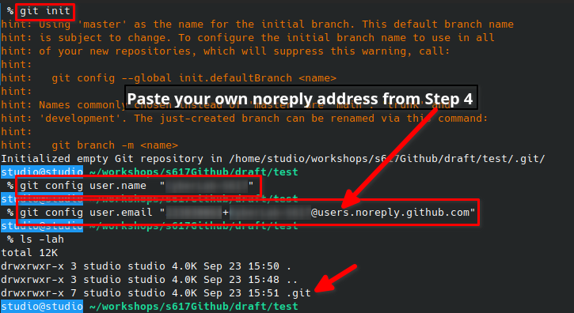
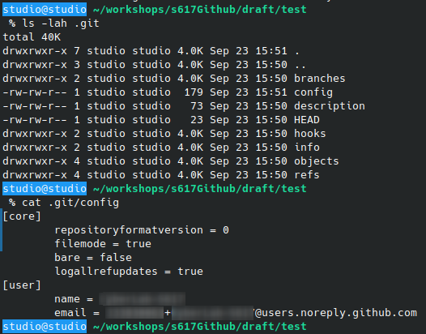
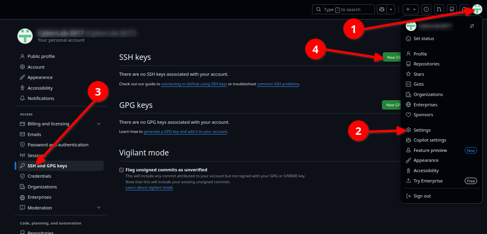

# Guide 1 - Secure GitHub Setup *(do this before the workshop)*

In about 30-40 minutes you'll create a GitHub account **the way a security
professional would** - locked down before you ever push code - and you'll arrive at
the workshop ready to build. The setup itself is the first lesson: the first thing a
security person does with a new account is secure it.

> ⚠️ **The golden rule:** turn on the privacy and security settings **before your
> first commit.** Once you push to a public repo, anything in it - including your
> email - is public *permanently*. Lock down first, commit second. Do the steps in order.

**You'll finish with:** a secured account (2FA on), your email hidden from commits,
Git installed and configured, and a secure SSH connection.

> 🧭 **Stuck?** GitHub Desktop is a friendly fallback for the command-line steps, and
> a classmate who's finished or an instructor can help. Nobody moves on until the
> whole room clears each checkpoint.

---

## Step 1 - Create your account
Go to **github.com** and sign up.
- **Choose a professional, permanent username** - some form of your real name. It goes
  on your resume for years; avoid anything that expires or you wouldn't want a recruiter to read.
- **Use a *personal* email as your primary address** - not `@live.hccc.edu`. *Why:* the
  primary email recovers a locked account; if it's the college mailbox, you lose access
  when that mailbox is disabled after you leave.
- *(Optional, later)* Add `@live.hccc.edu` as a **secondary** email to unlock the free
  GitHub Student Developer Pack while enrolled.

> The sign-up form with a username filled in.



## Step 2 - Verify your email
Confirm the code/link GitHub emails you. You can't create repos, fork, or push until it's verified.

> The email-verified confirmation.



## Step 3 - Turn on Two-Factor Authentication (Optional, but highly recommended)
**Settings -> Password and authentication -> Enable two-factor authentication.**
- Use an **authenticator app or a passkey - not SMS** (text codes are exposed to SIM-swapping).
- **Save your recovery codes offline.** They're your only way back in if you lose your phone.

> The 2FA setup screen.


## Step 4 - Hide your email *(before any commit)*
Every commit carries an email; pushed to a public repo, it's in the history forever.
Go to **Settings -> Emails** and tick **both**:
- ✅ **Keep my email addresses private** - GitHub gives you `ID+username@users.noreply.github.com`. **Copy it.**
- ✅ **Block command line pushes that expose my email** - your safety net; it refuses a push that would leak your address.

> The Emails page with both boxes checked and the noreply address shown.


## Step 5 - Install Git
- **Windows:** git-scm.com  . 
- **macOS:** `git --version` (offers to install) or Homebrew  . 
- **Linux:** `sudo apt install git`

```bash
git --version
```

> A terminal showing the version.


## Step 6 - Tell Git who you are *(with your private email)*
For global - all your operating system
```bash
git config --global user.name  "Your Name"
git config --global user.email "ID+username@users.noreply.github.com"
```
*(Paste your own noreply address from Step 4.)*

For only the directory of your project
```bash
git init
git config user.name  "Your Name"
git config user.email "ID+username@users.noreply.github.com"
```
*(Paste your own noreply address from Step 4.)*

> The terminal after both commands.



## Step 7 - Connect with an SSH key (Optional, out of the scope of that lab but, Worth to know about)
A GitHub SSH key allows you to securely connect your local computer to your GitHub account without having to type your username and password every time you interact with a repository.
Public-key cryptography you can see working: the private half never leaves your machine.
```bash
ssh-keygen -t ed25519 -C "s617-lab"
cat ~/.ssh/id_ed25519.pub
```
Set a passphrase when asked. Copy the whole public-key line and add it under
**Settings -> SSH and GPG keys -> New SSH key**.
> We are not going to use the command line during that lab. 
If you are planning to use GitHub Desktop the application will handles this for you.

> The "New SSH key" page. (The public key is safe to show. Never show the private key or passphrase.)


---

✅ **You're set up securely.** Account locked with 2FA, email hidden from commits,
SSH connected. Bring this account to the workshop - everything else builds on it.
