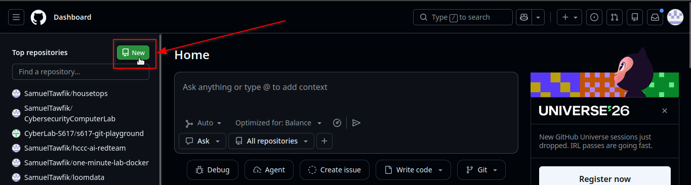
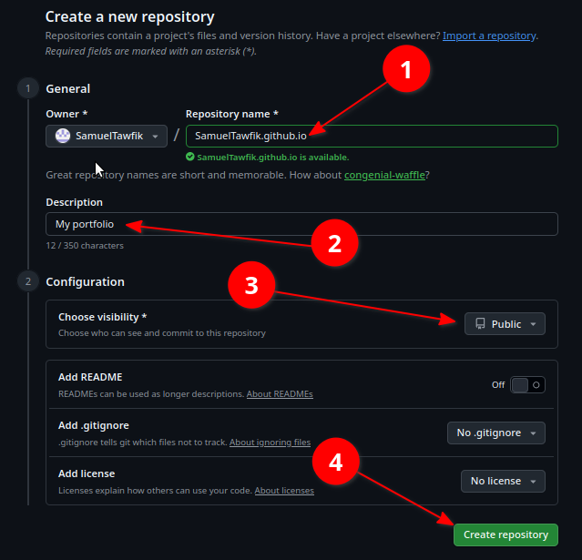
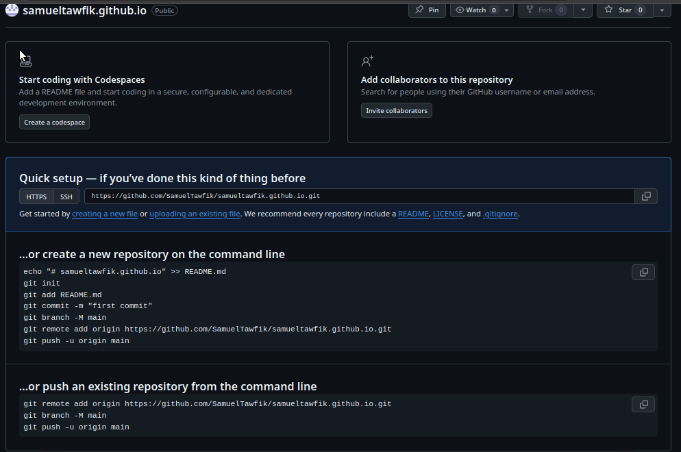
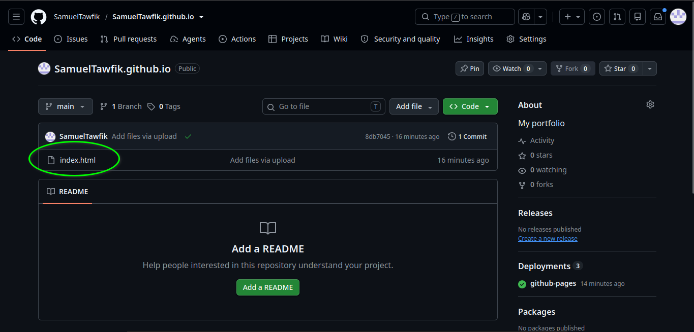
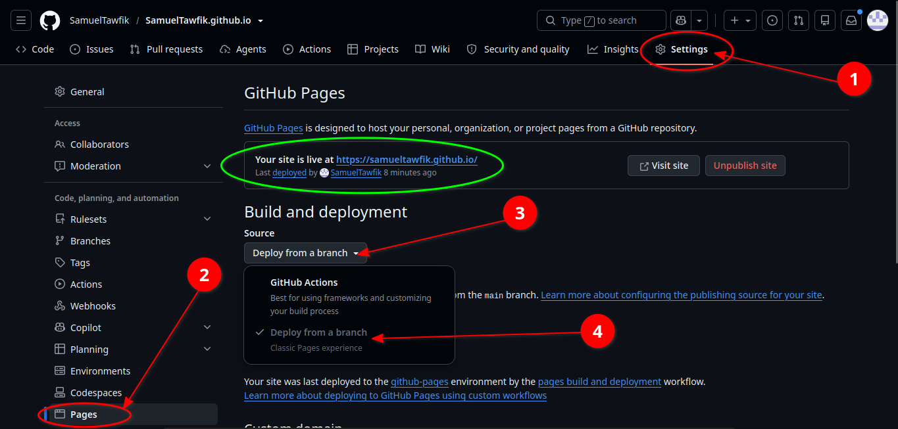
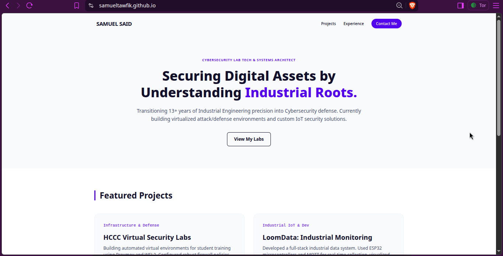

# Guide 3 - Build Your Portfolio Site

Now the real thing. You'll create your own repository, drop in a portfolio template, make it yours, and (as a stretch) publish it live on the web. **This repo is entirely yours** - separate from S617 - so it reads to a recruiter as your own work.

> Today's win is getting the template committed to your own repo. Getting it
> live on GitHub Pages is a great stretch goal - but if the clock beats you, that
> part is easy homework.

---

## Step 1 - Create your portfolio repo
Create a **new repository** named **exactly** `YOUR-USERNAME.github.io`
(all lowercase, your real username). *Why that name:* it publishes to the clean root
URL `https://your-username.github.io`, and it reads as 100% your own site. Make it **Public**.

> 📸 **Screenshot 01** - the "Create a new repository" form with the `username.github.io` name.

## Step 2 - Get the template
Fork S617 repo 
<!--  -->

Chose one of the templates in templates/portfolio/

From your **S617 fork**, open `templates/portfolio/index.html`, click **Raw**, and save
the file. Then add it to your new repo - the simplest way in the browser is
**Add file -> Upload files** on your new repo and drop `index.html` in.
*(Comfortable with the command line? Clone your new repo and copy `index.html` into it.)*

## Step 3 - Make it yours
Open `index.html` and fill in every spot marked with an `<!-- EDIT: ... -->` comment:
your name, role, a short about paragraph, your skills, and a couple of projects or lab
writeups. You don't need to touch the styling unless you want to.

> ✍️ Keep it honest and specific. "Built and documented a network-scanning lab with nmap"
> beats "passionate about cybersecurity." Recruiters read this first.

## Step 4 - Commit and push
Commit your changes (in the browser, that's the **Commit changes** button; from the
command line, `git add`, `git commit`, `git push`).

> 📸 **Screenshot 02** - your repo showing `index.html` committed.
<!--  -->

## Step 5 *(stretch)* - Go live with GitHub Pages
**Settings -> Pages -> Build and deployment -> Source: Deploy from a branch -> `main` / root -> Save.**
Wait a minute or two, then visit `https://your-username.github.io`.

> 📸 **Screenshot 03** - the Pages settings screen, source set to `main`.

> 📸 **Screenshot 04** - the live portfolio in a browser.
<!--  -->

---

✅ **You have a portfolio.** Even before it's live, your repo link works - which is all
you need for the next guide.
