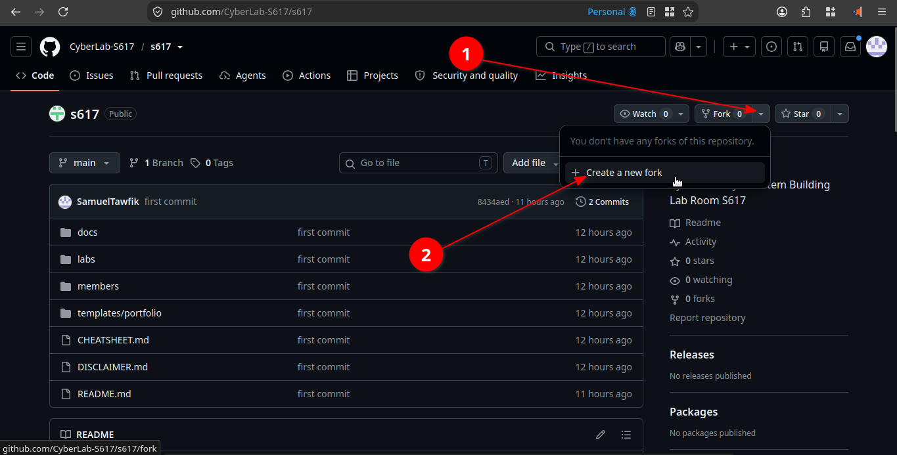
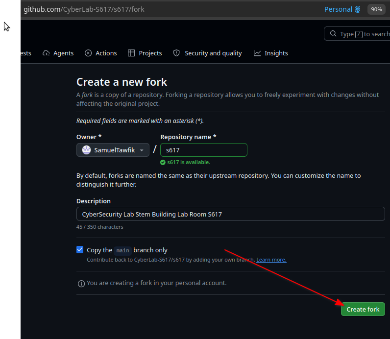
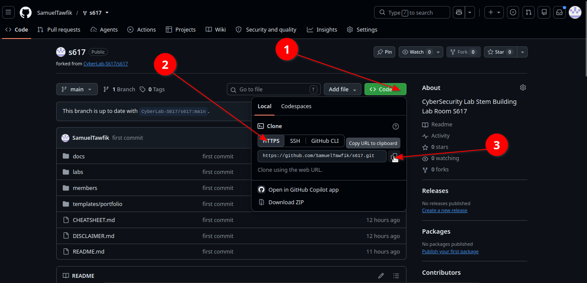
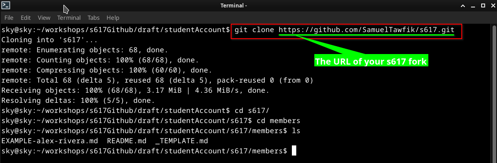
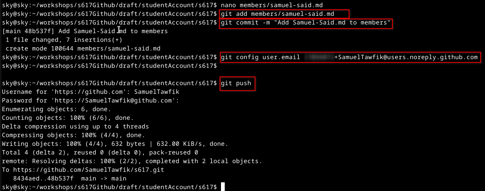
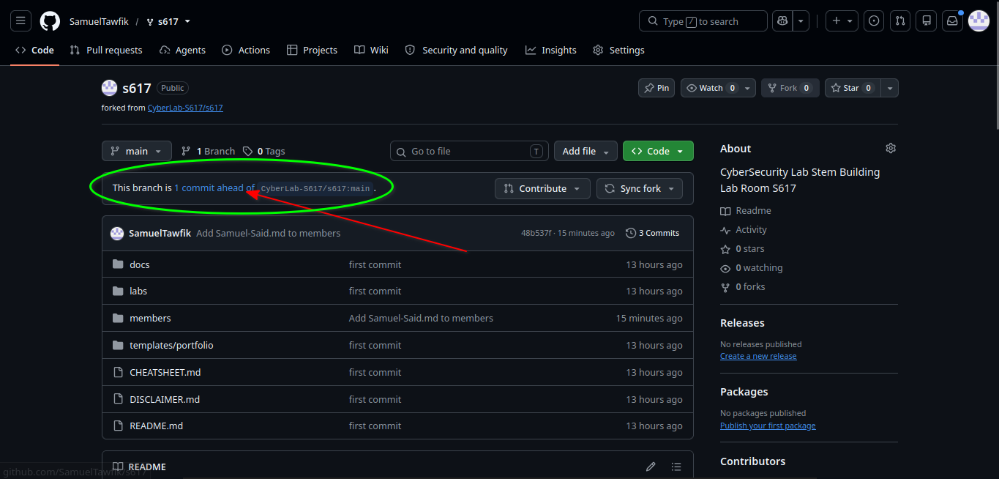
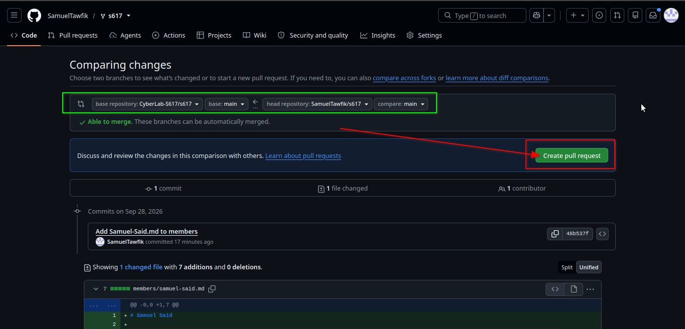
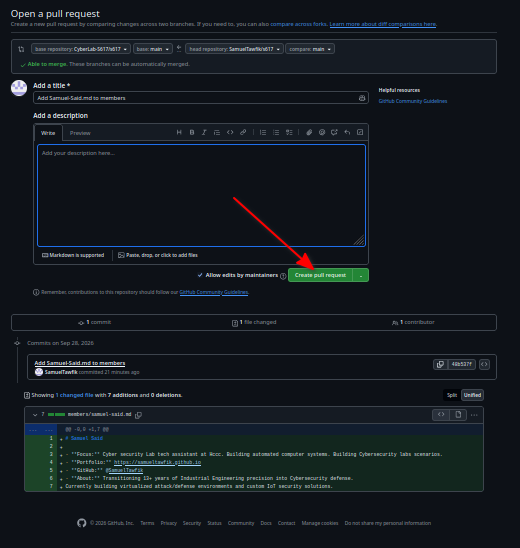

# Guide 4 - Add Yourself to the Directory *(your first real PR)*

Time to put your name on the S617 member directory - and make your first real pull
request. This is the same loop you practiced in Guide 2, now for keeps.

**Why Contributing to a public GitHub repository**

Contributing to a public GitHub repository builds your professional portfolio and hones your real-world skills.

** Career & Professional Growth**
> Visible Portfolio: Your public contributions act as a living résumé that recruiters and hiring managers can review directly.
> Job Opportunities: Active contributions can lead to networking connections, project collaborations, and job offers.
> Proof of Soft Skills: Following a project's Contributing Guidelines shows you can communicate well and follow instructions.

**Technical Skill Development**
> Real-World Git Practice: You gain hands-on experience with version control, branching, pull requests, and code reviews.
> Codebase Navigation: Reading and updating unfamiliar code teaches you how to solve problems in large projects.
> Constructive Feedback: Code reviews from project maintainers help improve your technical writing and coding standards.

**Community & Collaboration**
> Global Impact: Your fixes or features help improve open-source tools used by developers worldwide.
> Peer Networking: You connect with other creators, mentors, and industry professionals who share your technical interests.

---

## Step 1 - Copy the template
Create your fork of https://github.com/CyberLab-S617/s617.git using Github web interface 



Then click Create fork 



**Clone your fork of the repo**
copy the http link


in your copmputer open a terminal or cmd
then run the command git clone 'the link you just copied in the previus step'
git clone https://github.com/your-user-name/s617.git
cd s617/members




In your **S617 fork **, go to the `members/` folder. Copy `_TEMPLATE.md` to a **new
file** named after you: `members/firstname-lastname.md`.

> **You only add your *own* new file** - you never edit a shared list. That's why 25
> people can do this at once without a single merge conflict.

Create your file in that directory
using your favorit txt editor save a file named firstName-lastName.md
and write 

```text
# Your Name

- **Focus:** SOC Analysis .Threat Detection... etc
- **Portfolio:** https://your-username.github.io
- **GitHub:** @your-username
- **About:** Write something about you. Second-year cybersecurity student at HCCC, focused on blue-team work.
  Building detection labs and documenting them in my portfolio.
```
then save it as firstName-lastName.md in the members directory.

## Step 2 - Fill it in
Add your name, focus, and links. Point **Portfolio** at your repo now; swap in your live
`username.github.io` URL once Pages is up. (See `members/EXAMPLE-alex-rivera.md` for the format.)

## Step 3 - Commit and push to your fork
```bash
git add members/firstname-lastname.md
git commit -m "Add <your name> to the directory"
git push
```

> Your new members file, committed to your fork.


## Step 4 - Open the pull request
On your fork, click **Compare & pull request**, give it a clear title
("Add <your name> to the directory"), and **Create pull request**. Your entry is now
*proposed* to S617; once it's reviewed and merged, you're in the directory.

> The pull request open against the S617 repo.




---

✅ **That's a real contribution to a public repository** - the exact skill employers
look for. Your commit history now shows you can collaborate with Git.
