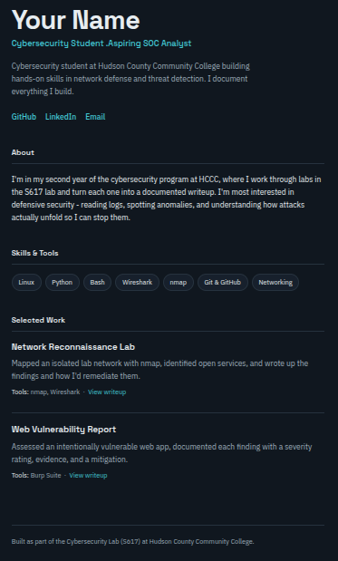
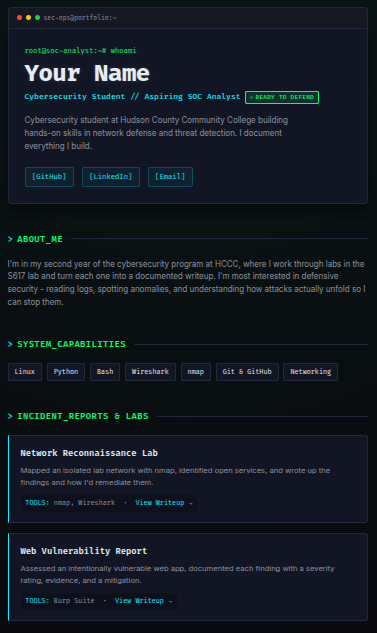
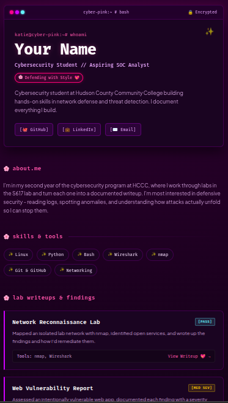
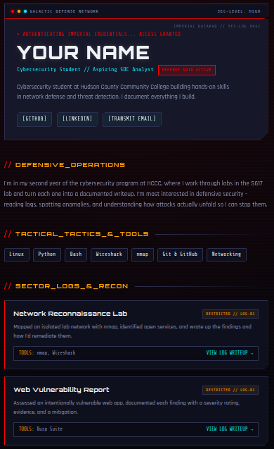

# Portfolio Template

A clean, single-file portfolio page you can publish on GitHub Pages. No build step,
no dependencies to install - just one `index.html` you edit and push.

## Use it
1. Create a repo named **`your-username.github.io`** (Public).
2. Copy **`index.html`** from this folder into that repo.
3. Open `index.html` and edit every spot marked `<!-- EDIT: ... -->` - your name,
   role, about, skills, and projects. You don't need to touch the styling.
4. Commit and push, then enable **Settings -> Pages -> Source: `main`**.
5. Your site goes live at `https://your-username.github.io`.

Full walkthrough: [docs/02-build-your-portfolio.md](../../docs/02-build-your-portfolio.md).

> A preview screenshot of the templates. 
Rename the file to `index.html` and edit it to make it yours.

plain-rename-to-index

cyber-rename-to-index

cybergirl-rename-to-index

cyberstar-rename-to-index

## Make it yours
The template is a starting point, not a finish line. Change the colors, fonts, and
layout as you learn - a portfolio that looks like *you* beats one that looks like
everyone else's. The styles live in the `<style>` block at the top of `index.html`.
